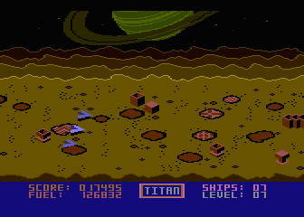

# Titan (prototype)

This game prototype, targeting the Atari 8-bit platform, has been reversed-engineered in the hopes that it facilitates the community to advance this forward into a functional game.

    Binary was provided by: Lee Pappas (A.N.A.L.O.G. Computing)
    Recovered by: Kay Savetz
    Author: Lee Pappas with Tom Hudson

## Notes

This requires a copy of [64tass](https://sourceforge.net/projects/tass64/) to assemble.

refer to:

https://forums.atariage.com/topic/234684-atari-8-bit-software-preservation-initiative/page/110/#comment-5472194
https://forums.atariage.com/topic/378256-lee-pappas-analog-disks-treasure-hunt/

### Files

    ANIMAT1.INC     charset utilized for object animation.
    ANIMAT2.INC     charset utilized for object animation.
    CRATERS.INC     charset for the playfield.
    MNTNS.INC       charset to the render the mountain range.
    SATURN.INC      Gfx for the background sky.
    DLIST.INC       Atari DisplayList (i.e. screen configuration)

    BOOTSTRAP.ASM   Boot Sector program. (loads DOS.SYS).
    INTERRUPTS.ASM  Vertical Blank and DisplayList interrupts.
    TITAN.ASM       Main program.  Contains Game logic, setup, etc.

### Memory Map

    [$80:D6]        zero-page

    [$3000:33FF]    mntns   [charset]
    [$3400:37FF]    craters [charset]
    [$5000:53FF]    animat1 [charset]
    [$5400:57FF]    animat2 [charset]

    [$6000:60CC]    display list
    [$60CD:6220]    interrupts
    [$6221:6536]    titan code
    [$6537:6729]    titan data

### Screen Memory

    [$3800:3CBF]    saturn  [gfx]
    [$4000:45FF]    playfield
    [$4800:4BFF]    mountain range
    [$606D:60CC]    panel

### Sound

not implement

### License

TBD
